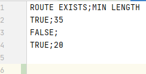
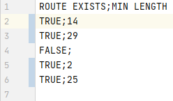

# DB_Best_internship_program

#### Hello everyone! This is a test task for DB Best Technologies.
When developing the application, the console version of the application was chosen.
For the sake of reducing the number of dependencies and minimizing the need to influence the JVM options.
When starting a JavaFH application, you need to write the JVM options:
```
--module-path PATH_TO_MY_JAVAFX_LIB --add-modules javafx.controls --add-modules javafx.fxml --add-modules javafx.graphics
```

##### The console version of the application selected.

##### The app runs several primary stages:

0) Starting app. 
1) Creating H2 DB and connecting.
1) Reading csv files.
2) Getting data from [1] and creating Nodes.
3) Uploading data from files into H2 DB.
3) Creating graph from Nodes [2].
4) Search route between the nodes into Graph.
5) Saving results in new result.csv file.
7) End of the app.

<br>

Let's describe the necessary steps in more detail.

1) Creating H2 Database. 

The application uses the embedded view of the Database. URL is "jdbc:h2:mem:".

2) Parsing of CSV files.

I was thinking to use the openxv library for parsing. But, in order to reduce the number of project dependencies (reduce the size of the project, increase the speed of parsing by reducing the amount of unnecessary functionality), a lightweight version of the parser was written.
For the sake of portability and flexibility, in case of substitution for another parser / mock, it is implemented from the interface.

As soon as the nodes are created, the relationships between them are added. The main object does not interact directly with the parser and the database. It interacts with the configurator. The configurator works with a parser and creates lists with nodes that it generates based on data from files.
```
List<Node> allNodes = configurator.getAllNodesWithDestinations();
```
3) Creating graph from Nodes and search route between two points.

The graph is formed by simply adding all the nodes from the listWithAllNodes to the graph structure. 
[Graph realization](https://github.com/programmersnake/DB_Best_internship_program/blob/master/src/main/java/com/kostin/water_pipeline_system/model/Graph.java)

Dijkstra's algorithm performs the search for all connections in the graph. 
[Dijkstra realization](https://github.com/programmersnake/DB_Best_internship_program/blob/master/src/main/java/com/kostin/water_pipeline_system/model/Dijkstra.java)

Our algorithm finds the minimum distance between nodes and returns this result. And adds each node a distance to all other nodes.

### Important note!
#### Since, in the water pipeline system, water flows in only one direction.
**Then our graph is unidirectional.** 
```
If there is a connection between node 1 and node 2, this does not mean that there is a connection between node 2 and node 1.
```

4) Saving results int new CSV file.

The results are saved to a file using the previously specified path.
Files with input values also have their specified paths too.
```
private final String[] urlsToFinalFilesWithInputDatas = new String[]{
                Objects.requireNonNull( this.getClass().getClassLoader().getResource( "csv/CSV_FileDescribeTheWaterPipelineSystem.csv" ) ).getFile().replaceFirst( "/C", "C" ).replaceAll( "%20", " " ),
                Objects.requireNonNull( this.getClass().getClassLoader().getResource( "csv/CSV_FileSetOfPoints.csv" ) ).getFile().replaceFirst( "/C", "C" ).replaceAll( "%20", " " )
        };
```

Substitutions in file paths occur when the application starts. The replacement of the character "% 20" by "" was written due to incorrect display of the space character (replacement with Unicode code) and incorrect operation of the program.

Forcing this symbol to be replaced solves this problem.

5) Database connection.

Communication with the embedded H2 database is done by sending ordinary SQL requests.

```
CREATE_DESCRIPTIONS_QUERY = "CREATE TABLE DESCRIPTIONS (idx INT, idy INT, length INT)";

CREATE_POINTS_QUERY = "CREATE TABLE POINTS (ida INT, idb INT)";

INSERT_DATA_INTO_DESCRIPTIONS_QUERY = "INSERT INTO DESCRIPTIONS VALUES(";

INSERT_DATA_INTO_POINTS_QUERY = "INSERT INTO POINTS VALUES(";

SELECT_DATA_FROM_TABLE_QUERY = "SELECT * FROM ";
```

Requests for receiving data, loading data into the database are performed by changing the ready-made SQL codes.

All command results when working with the database are duplicated in the console.

Sample:
```
H2: DATABASE created!
H2: Tables created!
H2: Data into table [Descriptions] uploaded!
H2: Data into table [Points] uploaded!
```

The highlights have been covered. Let's start testing the application.

_________________________________________________________________________________________________________________________________________________________

## Testing the application

## Test №1

#### Input data:

##### Describe the water pipeline system^


##### Set of points


After running the application, the console:


Created CSV file:



## Test №2

#### Input data:

##### Describe the water pipeline system^


##### Set of points


After running the application, the console:


Created CSV file:


## Test №3

#### Input data:

##### Describe the water pipeline system^


##### Set of points


After running the application, the console:


Created CSV file:


